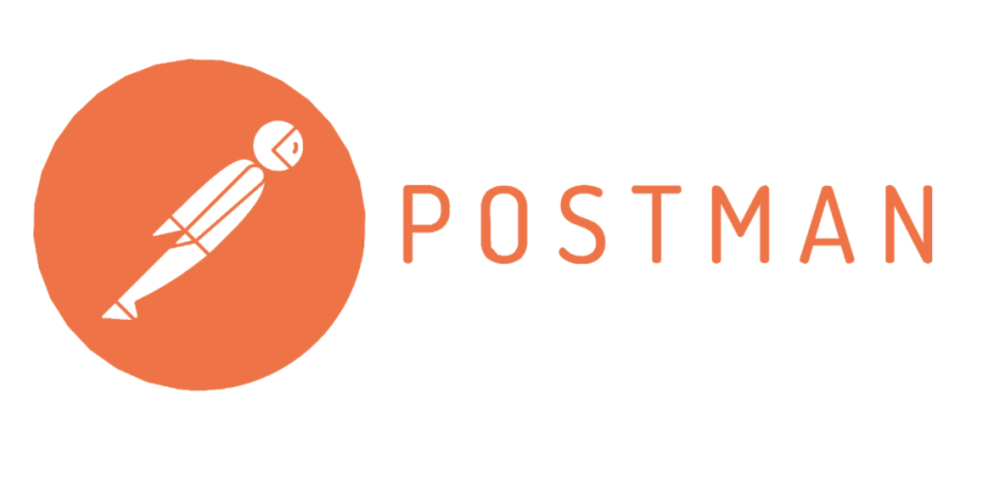
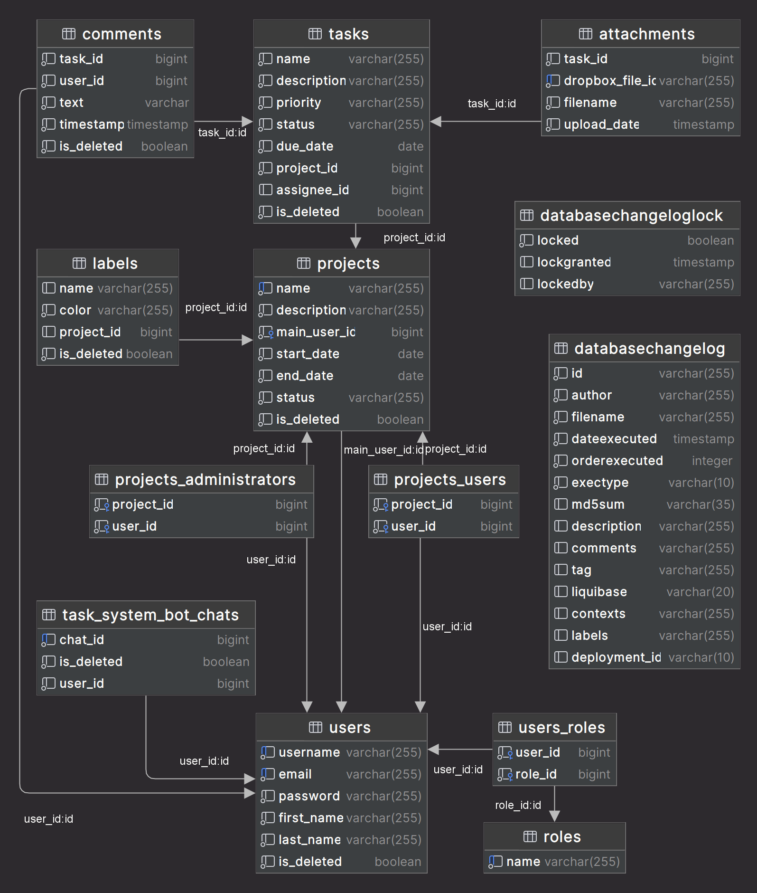

<body>
    <header>
        
        <h1 style="position: absolute; top: 170px; left: 50%; transform: translate(-50%); color: 
black;">
            Task Master
        </h1>
        

            Welcome to Task Master! Our platform revolutionizes project and task management, 
            providing a convenient and efficient experience for both users and administrators. 
            Task Master simplifies user registration, project and task management, user notifications, 
            and file storage through Dropbox integration. Whether you are assigning tasks, adding comments, 
            or managing attachments, Task Master ensures a streamlined workflow. 
            Thank you for choosing Task Master to enhance your productivity and project management experience.
        

        

            <a href="#technologies">Technologies used</a> <> 
            <a href="#how_to_use">How to use</a> <> 
            <a href="#entities">Entities</a> <> 
            <a href="#database-structure">Database Structure</a> <> 
            <a href="#endpoints">Endpoints</a> <> 
            <a href="#swagger">Swagger</a> <> 
            <a href="#notification">Notification</a>
        

    </header>
    

        <h2>Technologies used</h2>
        <ul>
            <li>
                 Java 17+
            </li>
            <li>
                
            </li>
            <li>
                 Spring Boot 
            </li>
            <li>
                 Spring Data JPA 
            </li>
            <li>
                 Spring Boot Security 
            </li>
            <li>
                 JSON Web Token
            </li>
            <li>
                 Lombok 
            </li>
            <li>
                 MapStruct 
            </li>
            <li>
                 Liquibase
            </li>
            <li>
                 PostgreSQL 
            </li>
            <li>
                 Hibernate
            </li>
            <li>
                 JUnit5
            </li>
            <li>
                 Testcontainers
            </li>
            <li>
                 Docker
            </li>
            <li>
                 Swagger
            </li>
            <li>
                 Dropbox API
            </li>
            <li>
                 Telegram API
            </li>
            <li>
                 Postman
            </li>
        </ul>
    

    

        <h2>How to use the project</h2>
        <h5>1. Before you start, make sure you have installed:</h5>
        <ul>
            <li>
                 JDK 17+
            </li>
            <li>
                 Docker
            </li>
            <li>
                If you wish, you can test the application in Postman:  Postman
            </li>
        </ul>
        
If you use Postman, go to the <code>postman</code> folder and import the file into Postman, 
        you will have all the endpoints that are in the application.

        <h5>2. Clone repository</h5>
        <pre>git clone https://github.com/0-zagar-0/Task-Master.git</pre>
        <h5>3.Create an .env file in the root directory</h5>
        
See an example of a sample <code>.env-sample</code>

        <h5>4.Run these commands to create a docker container and run the image</h5>
        <pre>docker-compose build</pre>
        <pre>docker-compose up</pre>
        <h5>5. Now whatever port you specified in SPRING_LOCAL_PORT, the program will run on that port</h5>
        <pre>example - http://localhost:8081</pre>
        <h3>General use</h3>
        <h5>6.There are already 10 users saved in the database:</h5>
        

            User with role ADMIN  
            <pre>email - admin@example.com password - User=123456789</pre> 
            User with role USER  
            <pre>There are 9 users, you can change the number after the word "user" from 1 to 9  email - user1@example.com password - User=123456789
            </pre> 
            to use the endpoints, can you register a new user.
        

        <h5>7.Dropbox</h5>
        
A test account has been created on the Dropbox platform, connect and test the application.
            <pre>email - intelej.dl9.zagara@gmail.com  password - 3215987Sanek</pre>
        

        
Follow this link <pre>https://www.dropbox.com/developers/apps</pre>

        
Select <code>My apps</code> - <code>Task Management System</code>. Then scroll to the bottom and <code>Generate Access token</code> and then insert it into the <code>application.properties</code> file in the appropriate line.

        <h2>Entities</h2>
        <h4>User</h4>
        <pre>
The user entity represents detailed information about registered users. 
At this stage, there are only 2 roles that grant certain access rights to users, these are: ADMIN and USER.
        </pre>
        <h4>Project</h4>
        <pre>
The Project entity allows users to manage their projects effectively. 
Each project includes a name, description, start date, end date, and status (which can be initiated, in progress, or completed). 
The Project Controller provides endpoints for creating, retrieving, updating, and deleting projects, 
ensuring secure and efficient project management for authorized users.
        </pre>
        <h4>Task</h4>
        <pre>
The Task entity enables users to manage their project tasks efficiently. Each task includes a name, description, priority (low, medium, high), 
status (not started, in progress, completed), due date, project ID, and assignee ID. The Task Controller provides endpoints for creating, 
retrieving, updating, and deleting tasks. Tasks can be assigned to users, and assignees are notified of new tasks. 
This functionality ensures streamlined task management within projects.
        </pre>
        <h4>Comment</h4>
        <pre>
The Comment entity allows users to add feedback and updates to tasks. Each comment includes a task ID, user ID, text, and timestamp. 
The Comment Controller provides endpoints for adding comments to a task and retrieving comments for a specific task. 
This feature facilitates clear communication and collaboration within projects by enabling users to add, 
view, and manage comments related to tasks.
        </pre>
        <h4>Attachment</h4>
        <pre>
Attachments enhance project collaboration by providing a mechanism to share files related to tasks. 
Integration with Dropbox ensures robust file storage and efficient retrieval. 
Access to attachment functionalities is restricted to authorized users to maintain security and privacy.
        </pre>
        <h4>Label</h4>
        <pre>
Labels enhance task management by providing a flexible way to categorize and filter tasks within projects. Users can create, modify, 
and delete labels as needed to suit project requirements. Assigning labels to tasks helps in organizing and prioritizing tasks effectively. 
Access to label functionalities is controlled to ensure that only authorized users can create, modify, or delete labels, 
maintaining data integrity and security.
        </pre>
    

    

        <h2> Database structure</h2>
        
    

    

        <h2>Endpoints</h2>
        <h3>Authentication Management</h3>
        <table>
            <tr>
                <th style="border: 1px solid #dddddd; text-align: left; padding: 8px;">HTTP Request</th>
                <th style="border: 1px solid #dddddd; text-align: left; padding: 8px;">Endpoints</th>
                <th style="border: 1px solid #dddddd; text-align: left; padding: 8px;">Security requirement</th>
                <th style="border: 1px solid #dddddd; text-align: left; padding: 8px;">Description</th>
            </tr>
            <tr>
                <td style="border: 1px solid #dddddd; text-align: left; padding: 8px;">POST</td>
                <td style="border: 1px solid #dddddd; text-align: left; padding: 8px;">/api/auth/register</td>
                <td style="border: 1px solid #dddddd; text-align: left; padding: 8px;">None</td>
                <td style="border: 1px solid #dddddd; text-align: left; padding: 8px;">Allows users to register a new account.</td>
            </tr>
            <tr>
                <td style="border: 1px solid #dddddd; text-align: left; padding: 8px;">POST</td>
                <td style="border: 1px solid #dddddd; text-align: left; padding: 8px;">/api/auth/login</td>
                <td style="border: 1px solid #dddddd; text-align: left; padding: 8px;">None</td>
                <td style="border: 1px solid #dddddd; text-align: left; padding: 8px;">Login with email and password. Response - JWT token</td>
            </tr>
        </table>
        <h3>User Management</h3>
        <table>
            <tr>
                <th style="border: 1px solid #dddddd; text-align: left; padding: 8px;">HTTP Request</th>
                <th style="border: 1px solid #dddddd; text-align: left; padding: 8px;">Endpoints</th>
                <th style="border: 1px solid #dddddd; text-align: left; padding: 8px;">Security requirement</th>
                <th style="border: 1px solid #dddddd; text-align: left; padding: 8px;">Description</th>
            </tr>
            <tr>
                <td style="border: 1px solid #dddddd; text-align: left; padding: 8px;">GET</td>
                <td style="border: 1px solid #dddddd; text-align: left; padding: 8px;">/api/users/me</td>
                <td style="border: 1px solid #dddddd; text-align: left; padding: 8px;">ADMIN, USER</td>
                <td style="border: 1px solid #dddddd; text-align: left; padding: 8px;"> Retrieves the profile information for the currently logged-in user.</td>
            </tr>
            <tr>
                <td style="border: 1px solid #dddddd; text-align: left; padding: 8px;">PUT</td>
                <td style="border: 1px solid #dddddd; text-align: left; padding: 8px;">/api/users/{id}/role</td>
                <td style="border: 1px solid #dddddd; text-align: left; padding: 8px;">ADMIN</td>
                <td style="border: 1px solid #dddddd; text-align: left; padding: 8px;">Enables users to update their roles, providing role-based access.</td>
            </tr>
            <tr>
                <td style="border: 1px solid #dddddd; text-align: left; padding: 8px;">PUT</td>
                <td style="border: 1px solid #dddddd; text-align: left; padding: 8px;">/api/users/me</td>
                <td style="border: 1px solid #dddddd; text-align: left; padding: 8px;">ADMIN, USER</td>
                <td style="border: 1px solid #dddddd; text-align: left; padding: 8px;">Allows users to update their profile information.</td>
            </tr>
        </table>
        <h3>Project Management</h3>
        <table>
            <tr>
                <th style="border: 1px solid #dddddd; text-align: left; padding: 8px;">HTTP Request</th>
                <th style="border: 1px solid #dddddd; text-align: left; padding: 8px;">Endpoints</th>
                <th style="border: 1px solid #dddddd; text-align: left; padding: 8px;">Security requirement</th>
                <th style="border: 1px solid #dddddd; text-align: left; padding: 8px;">Description</th>
            </tr>
            <tr>
                <td style="border: 1px solid #dddddd; text-align: left; padding: 8px;">POST</td>
                <td style="border: 1px solid #dddddd; text-align: left; padding: 8px;">/api/projects</td>
                <td style="border: 1px solid #dddddd; text-align: left; padding: 8px;">ADMIN, USER</td>
                <td style="border: 1px solid #dddddd; text-align: left; padding: 8px;">Permits the addition of new projects.</td>
            </tr>
            <tr>
                <td style="border: 1px solid #dddddd; text-align: left; padding: 8px;">GET</td>
                <td style="border: 1px solid #dddddd; text-align: left; padding: 8px;">/api/projects</td>
                <td style="border: 1px solid #dddddd; text-align: left; padding: 8px;">ADMIN, USER</td>
                <td style="border: 1px solid #dddddd; text-align: left; padding: 8px;">Provides a list of user's projects.</td>
            </tr>
            <tr>
                <td style="border: 1px solid #dddddd; text-align: left; padding: 8px;">GET</td>
                <td style="border: 1px solid #dddddd; text-align: left; padding: 8px;">/api/projects/{id}</td>
                <td style="border: 1px solid #dddddd; text-align: left; padding: 8px;">ADMIN, USER</td>
                <td style="border: 1px solid #dddddd; text-align: left; padding: 8px;">Retrieves detailed information about project</td>
            </tr>
            <tr>
                <td style="border: 1px solid #dddddd; text-align: left; padding: 8px;">PUT</td>
                <td style="border: 1px solid #dddddd; text-align: left; padding: 8px;">/api/projects/{id}</td>
                <td style="border: 1px solid #dddddd; text-align: left; padding: 8px;">ADMIN, USER</td>
                <td style="border: 1px solid #dddddd; text-align: left; padding: 8px;">Allows updates to project details.</td>
            </tr>
            <tr>
                <td style="border: 1px solid #dddddd; text-align: left; padding: 8px;">DELETE</td>
                <td style="border: 1px solid #dddddd; text-align: left; padding: 8px;">/api/project/{id}</td>
                <td style="border: 1px solid #dddddd; text-align: left; padding: 8px;">ADMIN, USER</td>
                <td style="border: 1px solid #dddddd; text-align: left; padding: 8px;">Enables project main user the removal of project.</td>
            </tr>
        </table>
        <h3>Task Management</h3>
        <table>
            <tr>
                <th style="border: 1px solid #dddddd; text-align: left; padding: 8px;">HTTP Request</th>
                <th style="border: 1px solid #dddddd; text-align: left; padding: 8px;">Endpoints</th>
                <th style="border: 1px solid #dddddd; text-align: left; padding: 8px;">Security requirement</th>
                <th style="border: 1px solid #dddddd; text-align: left; padding: 8px;">Description</th>
            </tr>
            <tr>
                <td style="border: 1px solid #dddddd; text-align: left; padding: 8px;">POST</td>
                <td style="border: 1px solid #dddddd; text-align: left; padding: 8px;">/api/tasks</td>
                <td style="border: 1px solid #dddddd; text-align: left; padding: 8px;">ADMIN, USER</td>
                <td style="border: 1px solid #dddddd; text-align: left; padding: 8px;">Permits the creation of new task.</td>
            </tr>
            <tr>
                <td style="border: 1px solid #dddddd; text-align: left; padding: 8px;">GET</td>
                <td style="border: 1px solid #dddddd; text-align: left; padding: 8px;">/api/tasks/project/{projectId}</td>
                <td style="border: 1px solid #dddddd; text-align: left; padding: 8px;">ADMIN, USER</td>
                <td style="border: 1px solid #dddddd; text-align: left; padding: 8px;">Retrieves tasks for a project.</td>
            </tr>
            <tr>
                <td style="border: 1px solid #dddddd; text-align: left; padding: 8px;">GET</td>
                <td style="border: 1px solid #dddddd; text-align: left; padding: 8px;">/api/tasks/{id} </td>
                <td style="border: 1px solid #dddddd; text-align: left; padding: 8px;">ADMIN, USER</td>
                <td style="border: 1px solid #dddddd; text-align: left; padding: 8px;">Retrieves task details</td>
            </tr>
            <tr>
                <td style="border: 1px solid #dddddd; text-align: left; padding: 8px;">PUT</td>
                <td style="border: 1px solid #dddddd; text-align: left; padding: 8px;">/api/tasks/{id}</td>
                <td style="border: 1px solid #dddddd; text-align: left; padding: 8px;">ADMIN, USER</td>
                <td style="border: 1px solid #dddddd; text-align: left; padding: 8px;">Allows project admins to update task details.</td>
            </tr>
            <tr>
                <td style="border: 1px solid #dddddd; text-align: left; padding: 8px;">DELETE</td>
                <td style="border: 1px solid #dddddd; text-align: left; padding: 8px;">/api/tasks/{id}</td>
                <td style="border: 1px solid #dddddd; text-align: left; padding: 8px;">ADMIN, USER</td>
                <td style="border: 1px solid #dddddd; text-align: left; padding: 8px;">Allows project admins to delete task.</td>
            </tr>
        </table>
        <h3>Comment Management</h3>
        <table>
            <tr>
                <th style="border: 1px solid #dddddd; text-align: left; padding: 8px;">HTTP Request</th>
                <th style="border: 1px solid #dddddd; text-align: left; padding: 8px;">Endpoints</th>
                <th style="border: 1px solid #dddddd; text-align: left; padding: 8px;">Security requirement</th>
                <th style="border: 1px solid #dddddd; text-align: left; padding: 8px;">Description</th>
            </tr>
          <tr>
                <td style="border: 1px solid #dddddd; text-align: left; padding: 8px;">POST</td>
                <td style="border: 1px solid #dddddd; text-align: left; padding: 8px;">/api/comments</td>
                <td style="border: 1px solid #dddddd; text-align: left; padding: 8px;">ADMIN, USER</td>
                <td style="border: 1px solid #dddddd; text-align: left; padding: 8px;">Permits the creation a comment.</td>
            </tr>
            <tr>
                <td style="border: 1px solid #dddddd; text-align: left; padding: 8px;">GET</td>
                <td style="border: 1px solid #dddddd; text-align: left; padding: 8px;">/api/comments?taskId= </td>
                <td style="border: 1px solid #dddddd; text-align: left; padding: 8px;">ADMIN, USER</td>
                <td style="border: 1px solid #dddddd; text-align: left; padding: 8px;">Retrieves a list task comments.</td>
            </tr>
            <tr>
                <td style="border: 1px solid #dddddd; text-align: left; padding: 8px;">PUT</td>
                <td style="border: 1px solid #dddddd; text-align: left; padding: 8px;">/api/comments/{id}</td>
                <td style="border: 1px solid #dddddd; text-align: left; padding: 8px;">ADMIN, USER</td>
                <td style="border: 1px solid #dddddd; text-align: left; padding: 8px;">Allows the user who wrote the comment to update it.</td>
            </tr>
            <tr>
                <td style="border: 1px solid #dddddd; text-align: left; padding: 8px;">DELETE</td>
                <td style="border: 1px solid #dddddd; text-align: left; padding: 8px;">/api/comments/{id}</td>
                <td style="border: 1px solid #dddddd; text-align: left; padding: 8px;">ADMIN, USER</td>
                <td style="border: 1px solid #dddddd; text-align: left; padding: 8px;">Allows the user who wrote the comment to delete it.</td>
            </tr>
        </table>
        <h3>Attachment Management</h3>
        <table>
            <tr>
                <th style="border: 1px solid #dddddd; text-align: left; padding: 8px;">HTTP Request</th>
                <th style="border: 1px solid #dddddd; text-align: left; padding: 8px;">Endpoints</th>
                <th style="border: 1px solid #dddddd; text-align: left; padding: 8px;">Security requirement</th>
                <th style="border: 1px solid #dddddd; text-align: left; padding: 8px;">Description</th>
            </tr>
          <tr>
                <td style="border: 1px solid #dddddd; text-align: left; padding: 8px;">POST</td>
                <td style="border: 1px solid #dddddd; text-align: left; padding: 8px;">/api/attachments</td>
                <td style="border: 1px solid #dddddd; text-align: left; padding: 8px;">ADMIN, USER</td>
                <td style="border: 1px solid #dddddd; text-align: left; padding: 8px;">Upload an attachment to a task (File gets uploaded to Dropbox and we store the Dropbox File ID in our database).</td>
            </tr>
            <tr>
                <td style="border: 1px solid #dddddd; text-align: left; padding: 8px;">GET</td>
                <td style="border: 1px solid #dddddd; text-align: left; padding: 8px;">/api/attachments/{attachmentId}</td>
                <td style="border: 1px solid #dddddd; text-align: left; padding: 8px;">ADMIN, USER</td>
                <td style="border: 1px solid #dddddd; text-align: left; padding: 8px;">Retrieve(download) attachment for a task (Get the Dropbox File ID from the database and retrieve the actual file from Dropbox).</td>
            </tr>
            <tr>
                <td style="border: 1px solid #dddddd; text-align: left; padding: 8px;">GET</td>
                <td style="border: 1px solid #dddddd; text-align: left; padding: 8px;">/api/attachments/task/{id}</td>
                <td style="border: 1px solid #dddddd; text-align: left; padding: 8px;">ADMIN, USER</td>
                <td style="border: 1px solid #dddddd; text-align: left; padding: 8px;">Retrieve(downloads) all attachments for a task .</td>
            </tr>
        </table>  
        <h3>Label Management</h3>
        <table>
            <tr>
                <th style="border: 1px solid #dddddd; text-align: left; padding: 8px;">HTTP Request</th>
                <th style="border: 1px solid #dddddd; text-align: left; padding: 8px;">Endpoints</th>
                <th style="border: 1px solid #dddddd; text-align: left; padding: 8px;">Security requirement</th>
                <th style="border: 1px solid #dddddd; text-align: left; padding: 8px;">Description</th>
            </tr>
            <tr>
                <td style="border: 1px solid #dddddd; text-align: left; padding: 8px;">POST</td>
                <td style="border: 1px solid #dddddd; text-align: left; padding: 8px;">/api/labels</td>
                <td style="border: 1px solid #dddddd; text-align: left; padding: 8px;">ADMIN, USER</td>
                <td style="border: 1px solid #dddddd; text-align: left; padding: 8px;">Permits the creation of new label.</td>
            </tr>
            <tr>
                <td style="border: 1px solid #dddddd; text-align: left; padding: 8px;">GET</td>
                <td style="border: 1px solid #dddddd; text-align: left; padding: 8px;">/api/labels/project/{projectId}</td>
                <td style="border: 1px solid #dddddd; text-align: left; padding: 8px;">ADMIN, USER</td>
                <td style="border: 1px solid #dddddd; text-align: left; padding: 8px;">Retrieves all labels for a project.</td>
            </tr>
            <tr>
                <td style="border: 1px solid #dddddd; text-align: left; padding: 8px;">GET</td>
                <td style="border: 1px solid #dddddd; text-align: left; padding: 8px;">/api/labels/{id} </td>
                <td style="border: 1px solid #dddddd; text-align: left; padding: 8px;">ADMIN, USER</td>
                <td style="border: 1px solid #dddddd; text-align: left; padding: 8px;">Retrieves label details</td>
            </tr>
            <tr>
                <td style="border: 1px solid #dddddd; text-align: left; padding: 8px;">PUT</td>
                <td style="border: 1px solid #dddddd; text-align: left; padding: 8px;">/api/labels/{id}</td>
                <td style="border: 1px solid #dddddd; text-align: left; padding: 8px;">ADMIN, USER</td>
                <td style="border: 1px solid #dddddd; text-align: left; padding: 8px;">Allows to update label details.</td>
            </tr>
            <tr>
                <td style="border: 1px solid #dddddd; text-align: left; padding: 8px;">DELETE</td>
                <td style="border: 1px solid #dddddd; text-align: left; padding: 8px;">/api/labels/{id}</td>
                <td style="border: 1px solid #dddddd; text-align: left; padding: 8px;">ADMIN, USER</td>
                <td style="border: 1px solid #dddddd; text-align: left; padding: 8px;">Allows to delete label.</td>
            </tr>
        </table>
    

    

        <h1>Swagger-ui usages</h1>
        

            If you will test the application locally in swagger, then after launching the application, follow this link. Use the port specified in the .env file
            <pre>http://localhost:8081/api/swagger-ui/index.html#</pre>
        

    

    

        <h1>Notification Service</h1>
        

A telegram bot was created for managers to notify them about newly created reservations and paid or canceled payments. You can join the bot when you test the application.

        <pre>https://t.me/task_management_system_new_bot</pre>
    

</body>